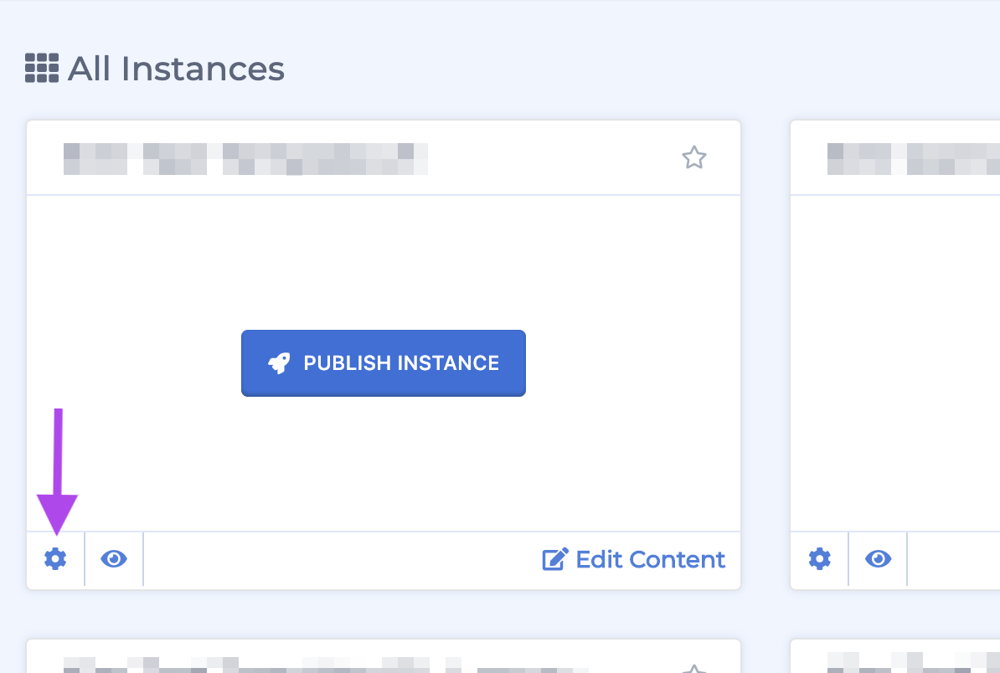
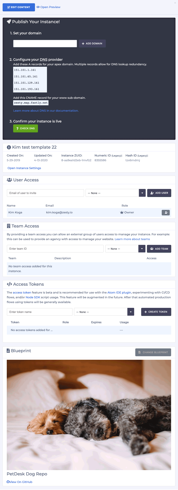
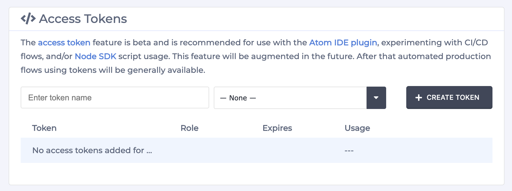
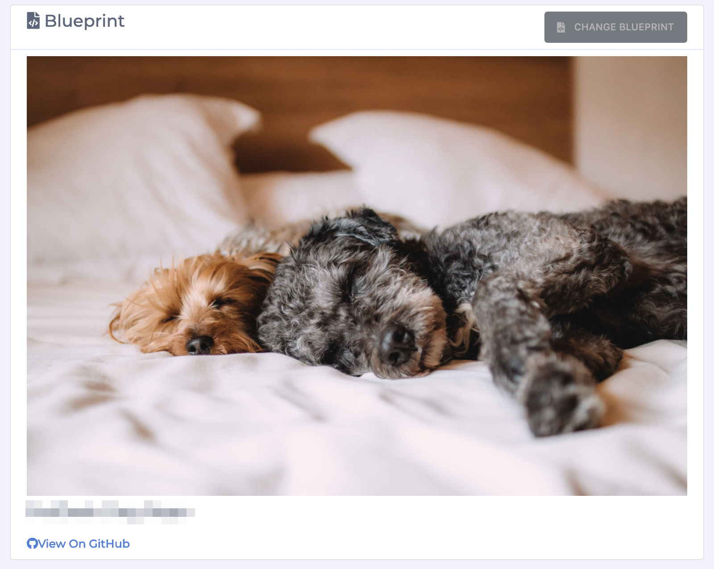

# Instance Settings Drawer

### Overview

The Instance Settings Drawer contains many of an instances general settings. Any user who has access to the instance has access to the Instance Settings Drawer. The following items can be accessed via this drawer:&#x20;

* Buttons to access Content Manager, preview and live links
* Domain name and DNS instructions
* General instance information:
  * Name
  * ZUID
  * Created on date
  * Updated on date
  * Legacy Hash and Numeric IDs
* User Access
* Team Access
* Access Tokens
* Blueprint Settings
  * Blueprint name
  * GitHub Link
  * Change blueprint button

### Accessing the Instance Settings Drawer

Access the Instance Settings Drawer via the cog icon on an instance's card in the all-instance's grid view. Click the icon and a drawer will slide out from the right-hand side of the screen.

From the all-instances list view, simply select an instance from the list and the settings will be shown in the right-hand portion of the screen.

### Instance Settings Drawer Tour

The full Instance Settings drawer is shown in full below.&#x20;

We'll review each section with a short description below.

#### Buttons to access CMS, preview and live links

From left to right there is a:

* Button to access the Content Manger
* Preview link
* Live link

These links are also available from the instance card and instance list in the all-instances view.

#### Domain name and DNS instructions

The domain settings include a field to set your domain name, as well as brief DNS instructions.

#### General instance information:

The general information from top to bottom and left to right is:

* Instance Name
* Created On date
* Updated On date
* Instance ZUID
* Numeric ID (Legacy)
* Hash ID (Legacy)

#### User Access

The User Access section allows users to be invited to access the instance. When a user is invited to access an instance their role is set as well.

#### Team Access

The Team Access section allows for teams to be added to an instance.&#x20;


Teams are not created in this section. Learn more about Team creation with this [guide](https://zesty.org/guides/adding-a-team).


#### Access Tokens

The Access Tokens section allow for access tokens to be created for use with the Atom IDE as well as other workflows.&#x20;

#### Blueprint

The Blueprint section allows users to change their blueprint.&#x20;


When a blueprint is changed a user will lose all of their content, code, etc. If you do not want to lose the contents of your instance **do not** change your blueprint.&#x20;


It also shows the blueprint's name and cover image, and links to its repository on Github.
