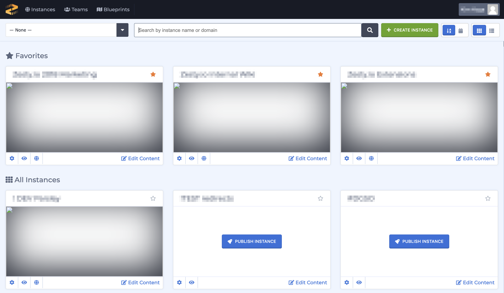

# Quick Start Guide

### Overview

The Zesty WebEngine has several features to ensure a smooth integration of you content. Throughout the quick start guide, we highlight some of these features that you will need to get started. Once familiar with general process of creating an Instance and content, a user can take a deep dive into the additional features with ease. Let's get started!


**Hint:** Inside the WebEngine you will notice the Docs button on several screens. These helpers will take you directly to the search results, in the Zesty Docs, that pertain to what you are working on. Try them out!&#x20;


### Logging into the Account Manager

The Account Manager houses all of your **instances**. Your instances are your unique projects created in the Zesty.io platform.

Upon logging into your account, you are brought to the Account Manager. Within this interface you have administrative control over creating new instances, access to current instances, creating and updating  teams. Viewing options for your interface can be toggled and shown below.


Toggling between a List view or Tile view can be done by selecting the option in the top right corner


#### Grid view

#### List View

### Creating a Team

Creating a team facilitates adding an entire team to an instance. This may be most beneficial for extensive platform use that includes several instances and a large roster of developers. By creating a break down of teams by project, you can easily apply an entire team where needed. Navigate to the Teams  interface by selecting the Teams tab located in the top navigation.&#x20;


Follow the link for an in-depth look at [Teams](../../../accounts/ui/teams.md#overview)&#x20;


### Instance Settings

Instance settings can also be accessed from the Account Manager. Selecting an Instance provides access to the Instance Setting Drawer. From here you will have the ability to view and update the [**Instance Settings**](instance-settings.md) below:

* Add and update domains
* Find the Instance [ZUID](../glossary.md#zuid) and creation information&#x20;
* Create access to the Instance
  * You can add an [individual User](../../../accounts/ui/instance-settings-drawer.md#user-access) to the access of the Instance &#x20;
  * Or you can create [Team](../../../accounts/ui/instance-settings-drawer.md#team-access) access to an Instance&#x20;
* Create Access Tokens for:
  * Atom IDE Plugin
  * Node SDK
  * Outside User
* View Blueprint selected for the Instance

This process will be covered in more detail in an upcoming section of the Quick Start Guide.

### Next Steps

In the following several sections, you will be introduced the process of using the Zesty platform. Including creating a new Instance, content and publishing all through the WebEngine.
